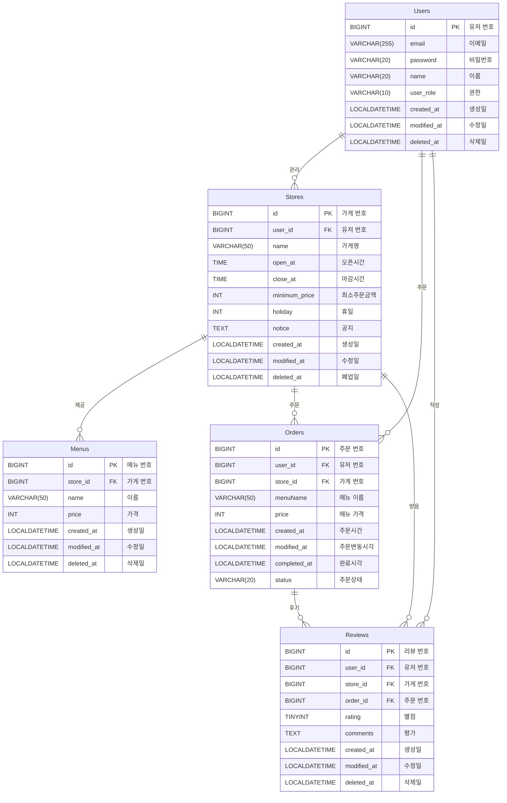

# 🛠️ **Sparta Delivery API Documentation**

## 🏁 **프로젝트 목표**

> **"Sparta Delivery 아웃소싱 프로젝트"**  
> 이 문서는 Sparta Delivery 프로젝트 16조 3BodyProgrammers의 API 명세서, 주요 기능 및 트러블슈팅 내용을 다룹니다.

---

## 👥 **팀 구성**

| 전탁                                    | 김지영                                       | 김유란                                 |
|---------------------------------------|-------------------------------------------|-------------------------------------|
| 팀장                                    | 팀원                                        | 팀원                                  |
| [JeonTak](https://github.com/JEONTAK) | [KIM JIYEONG](https://github.com/flammaa) | [yrkim](https://github.com/yoorkim) |
| INTJ                                  | INTP                                      | ISFP                                |
| https://velog.io/@tak980418/posts     | https://velog.io/@flamma/posts            | https://velog.io/@yyrkk/posts       |

---

## 📅 **개발 일정 및 역할 분담**

| 항목      | 담당자      | 시작 날짜       | 상태 | 완료 날짜       |
|---------|----------|-------------|----|-------------|
| 로그인     | 김유란      | 2025년 3월 2일 | 완료 | 2025년 3월 4일 |
| 유저      | 김유란      | 2025년 3월 3일 | 완료 | 2025년 3월 4일 |
| 가게      | 전탁       | 2025년 3월 1일 | 완료 | 2025년 3월 4일 |
| 메뉴      | 전탁       | 2025년 3월 3일 | 완료 | 2025년 3월 4일 |
| 주문      | 김지영      | 2025년 3월 2일 | 완료 | 2025년 3월 6일 |
| 리뷰      | 김유란, 김지영 | 2025년 3월 2일 | 완료 | 2025년 3월 5일 |
| 통합 검색   | 전탁       | 2025년 3월 5일 | 완료 | 2025년 3월 5일 |
| 가게 대시보드 | 전탁       | 2025년 3월 6일 | 완료 | 2025년 3월 6일 |

---

## 📄 **API 명세서**

### 🔑 로그인

| 담당자 | 상태 | HTTP 메서드 | 기능   | URL             | 인증 필요 | 파라미터 | 요청 데이터                                                                        | 응답 코드 및 설명                                      | 응답 데이터                |
|-----|----|----------|------|-----------------|-------|------|-------------------------------------------------------------------------------|-------------------------------------------------|-----------------------|
| 김유란 | 완료 | POST     | 회원가입 | `/auths/signup` | NO    | NONE | `{ "email": string, "password": string, "name": string, "userRole": string }` | `200 OK`, `400 Bad Request`                     | `{ "token": string }` |
| 김유란 | 완료 | POST     | 로그인  | `/auths/signin` | NO    | NONE | `{ "email": string, "password": string }`                                     | `200 OK`, `400 Bad Request`, `401 Unauthorized` | `{ "token": string }` |

### 👤 유저

| 담당자 | 상태 | HTTP 메서드 | 기능      | URL      | 인증 필요 | 파라미터 | 요청 데이터                                                             | 응답 코드 및 설명                  | 응답 데이터                                                                                                           |
|-----|----|----------|---------|----------|-------|------|--------------------------------------------------------------------|-----------------------------|------------------------------------------------------------------------------------------------------------------|
| 김유란 | 완료 | POST     | 회원탈퇴    | `/users` | YES   | NONE | `{ "password": string }`                                           | `200 OK`, `400 Bad Request` | `{ "message": string }`                                                                                          |
| 김유란 | 완료 | GET      | 내 정보 조회 | `/users` | YES   | NONE | NONE                                                               | `200 OK`, `400 Bad Request` | `{ "id": long, "email": string, "name": string, "userRole": string, "createdAt": string, "modifiedAt": string }` |
| 김유란 | 완료 | PUT      | 내 정보 수정 | `/users` | YES   | NONE | `{ "oldPassword": string, "newPassword": string, "name": string }` | `200 OK`, `400 Bad Request` | `{ "id": long, "email": string, "name": string, "userRole": string, "createdAt": string, "modifiedAt": string }` |

### 🏪 가게

| 담당자 | 상태 | HTTP 메서드 | 기능       | URL                   | 인증 필요 | 파라미터                        | 요청 데이터                                                                                       | 응답 코드 및 설명                                   | 응답 데이터                                                                                                                                                                                      |
|-----|----|----------|----------|-----------------------|-------|-----------------------------|----------------------------------------------------------------------------------------------|----------------------------------------------|---------------------------------------------------------------------------------------------------------------------------------------------------------------------------------------------|
| 전탁  | 완료 | POST     | 가게 생성    | `/stores`             | YES   | NONE                        | `{ "name": string, "openAt": time, "closeAt": time, "minimunPrice": int, "notice": string }` | `200 OK`, `400 Bad Request`, `403 Forbidden` | `{ "id": long, "name": string, "openAt": string, "closeAt": string, "minimunPrice": int, "notice": string, "createdAt": string, "modifiedAt": string }`                                     |
| 전탁  | 완료 | GET      | 전체 가게 조회 | `/stores`             | YES   | Query Parameters:           | `name (string), page (int, default: 1), size (int, default: 10)`                             | `200 OK` (Page 형식)                           | `{ "id": long, "name": string, "openAt": string, "closeAt": string, "minimunPrice": int, "holidays": {…}, "createdAt": string, "modifiedAt": string }`                                      |
| 전탁  | 완료 | GET      | 가게 단건 조회 | `/stores/{id}`        | YES   | Path Parameter: `id (Long)` | NONE                                                                                         | `200 OK`, `400 Bad Request`                  | `{ "id": long, "name": string, "openAt": string, "closeAt": string, "minimunPrice": int, "holidays": {…}, "notice": string, "menuList": { … }, "createdAt": string, "modifiedAt": string }` |
| 전탁  | 완료 | PUT      | 가게 수정    | `/stores/{id}`        | YES   | Path Parameter: `id (Long)` | `{ "name": string, "openAt": time, "closeAt": time, "minimunPrice": int, "notice": string }` | `200 OK`, `400 Bad Request`, `403 Forbidden` | `{ "id": long, "name": string, "openAt": string, "closeAt": string, "minimunPrice": int, "holidays": {…}, "notice": string, "createdAt": string, "modifiedAt": string }`                    |
| 전탁  | 완료 | POST     | 가게 폐업    | `/stores/delete/{id}` | YES   | Path Parameter: `id (Long)` | NONE                                                                                         | `200 OK`, `400 Bad Request`, `403 Forbidden` | `{ "message": string }`                                                                                                                                                                     |

### 🛏️ 가게 휴일

| 담당자 | 상태 | HTTP 메서드 | 기능    | URL                          | 인증 필요 | 파라미터                   | 요청 데이터                         | 응답 코드 및 설명                                   | 응답 데이터                                                                                                                                                 |
|-----|----|----------|-------|------------------------------|-------|------------------------|--------------------------------|----------------------------------------------|--------------------------------------------------------------------------------------------------------------------------------------------------------|
| 전탁  | 완료 | POST     | 휴일 수정 | `/stores/{storeId}/holidays` | YES   | Path: `storeId (Long)` | `{ "holidays": List<String> }` | `200 OK`, `400 Bad Request`, `403 Forbidden` | `{ "id": long, "name": string, "openAt": string, "closeAt": string, "minimunPrice": int, "holidays": {…}, "createdAt": string, "modifiedAt": string }` |

### 🍽️ 메뉴

| 담당자 | 상태 | HTTP 메서드 | 기능    | URL                                   | 인증 필요 | 파라미터                              | 요청 데이터                             | 응답 코드 및 설명                                   | 응답 데이터                                                                                    |
|-----|----|----------|-------|---------------------------------------|-------|-----------------------------------|------------------------------------|----------------------------------------------|-------------------------------------------------------------------------------------------|
| 전탁  | 완료 | POST     | 메뉴 생성 | `/stores/{storeId}/menus`             | YES   | Path: `storeId (Long)`            | `{ "name": string, "price": int }` | `200 OK`, `400 Bad Request`, `403 Forbidden` | `{ "id": long, "name": string, "price": int, "createdAt": string, "modifiedAt": string }` |
| 전탁  | 완료 | PUT      | 메뉴 수정 | `/stores/{storeId}/menus/{id}`        | YES   | Path: `storeId (Long), id (Long)` | `{ "name": string, "price": int }` | `200 OK`, `400 Bad Request`, `403 Forbidden` | `{ "id": long, "name": string, "price": int, "createdAt": string, "modifiedAt": string }` |
| 전탁  | 완료 | POST     | 메뉴 삭제 | `/stores/{storeId}/menus/delete/{id}` | YES   | Path: `storeId (Long), id (Long)` | NONE                               | `200 OK`, `400 Bad Request`, `403 Forbidden` | `{ "message": string }`                                                                   |

### 📦 주문

| 담당자 | 상태 | HTTP 메서드 | 기능       | URL                   | 인증 필요 | 파라미터                                                     | 요청 데이터                                 | 응답 코드 및 설명                                                    | 응답 데이터                                                                                                                                           |
|-----|----|----------|----------|-----------------------|-------|----------------------------------------------------------|----------------------------------------|---------------------------------------------------------------|--------------------------------------------------------------------------------------------------------------------------------------------------|
| 김지영 | 완료 | POST     | 주문 생성    | `/orders`             | YES   | Path: `storeId (Long)`                                   | `{ "menuName": string, "price": int }` | `200 OK`, `400 Bad Request`, `403 Forbidden`                  | `{ "id": long, "storeId": long, "menuName": string, "price": int, "status": string, "createdAt": string, "modifiedAt": string }`                 |
| 김지영 | 완료 | PATCH    | 주문 상태 변경 | `/orders/{id}/status` | YES   | Path: `id (Long)`                                        | `{ "status": string }`                 | `200 OK`, `400 Bad Request`, `403 Forbidden`, `404 Not Found` | `{ "id": long, "userId": long, "storeId": long, "menuName": string, "price": int, "status": string, "createdAt": string, "modifiedAt": string }` |
| 김지영 | 완료 | GET      | 전체 주문 조회 | `/orders`             | YES   | Query: `page (int, default: 1), size (int, default: 10)` | NONE                                   | `200 OK` (Page 형식)                                            | `{ "id": long, "userId": long, "storeId": long, "menuName": string, "price": int, "status": string, "createdAt": string, "modifiedAt": string }` |
| 김지영 | 완료 | GET      | 주문 단건 조회 | `/orders/{id}`        | YES   | Path: `id (Long)`                                        | NONE                                   | `200 OK`, `403 Forbidden`, `404 Not Found`                    | `{ "id": long, "userId": long, "storeId": long, "menuName": string, "price": int, "status": string, "createdAt": string, "modifiedAt": string }` |
| 김지영 | 완료 | DELETE   | 주문 취소    | `/orders/{id}`        | YES   | Path: `id (Long)`                                        | NONE                                   | `200 OK`, `400 Bad Request`, `403 Forbidden`, `404 Not Found` | `{ "message": string }`                                                                                                                          |

### ⭐ 리뷰

| 담당자 | 상태 | HTTP 메서드 | 기능    | URL                         | 인증 필요 | 파라미터                                                                             | 요청 데이터                                   | 응답 코드 및 설명                                                    | 응답 데이터                                                                                                                                                                                                                  |
|-----|----|----------|-------|-----------------------------|-------|----------------------------------------------------------------------------------|------------------------------------------|---------------------------------------------------------------|-------------------------------------------------------------------------------------------------------------------------------------------------------------------------------------------------------------------------|
| 김유란 | 완료 | POST     | 리뷰 생성 | `/orders/{orderId}/reviews` | YES   | Path: `orderId (Long)`                                                           | `{ "rating": byte, "comments": string }` | `200 OK`, `400 Bad Request`, `403 Forbidden`, `404 Not Found` | `{ "id": long, "userId": long, "storeId": long, "orderId": long, "rating": byte, "comments": string, "createdAt": string, "modifiedAt": string }`                                                                       |
| 김유란 | 완료 | GET      | 리뷰 조회 | `/stores/{storeId}/reviews` | YES   | Path: `storeId (Long)`, Query: `page (int, default: 1), size (int, default: 10)` | NONE                                     | `200 OK`, `400 Bad Request`                                   | `{ "Page 형태의 { "id": long, "userId": long, "storeId": long, "orderId": long, "rating": byte, "comments": string, "createdAt": string, "modifiedAt": string }, "totalReviewCount": long, "averageReviewScore": double }` |
| 김유란 | 완료 | PUT      | 리뷰 수정 | `/reviews/{id}`             | YES   | Path: `id (Long)`                                                                | `{ "rating": byte, "comments": string }` | `200 OK`, `400 Bad Request`, `403 Forbidden`, `404 Not Found` | `{ "id": long, "userId": long, "storeId": long, "orderId": long, "rating": byte, "comments": string, "createdAt": string, "modifiedAt": string }`                                                                       |
| 김유란 | 완료 | POST     | 리뷰 삭제 | `/reviews/delete/{id}`      | YES   | Path: `id (Long)`                                                                | NONE                                     | `200 OK`, `400 Bad Request`, `403 Forbidden`, `404 Not Found` | `{ "message": string }`                                                                                                                                                                                                 |

### 🔍 통합 검색

| 담당자 | 상태 | HTTP 메서드 | 기능    | URL        | 인증 필요 | 파라미터                                                                    | 요청 데이터 | 응답 코드 및 설명         | 응답 데이터                                                                                                                                                 |
|-----|----|----------|-------|------------|-------|-------------------------------------------------------------------------|--------|--------------------|--------------------------------------------------------------------------------------------------------------------------------------------------------|
| 전탁  | 완료 | GET      | 통합 검색 | `/searchs` | YES   | Query: `name (string), page (int, default: 1), size (int, default: 10)` | NONE   | `200 OK` (Page 형식) | `{ "id": long, "name": string, "openAt": string, "closeAt": string, "minimunPrice": int, "holidays": {…}, "createdAt": string, "modifiedAt": string }` |

### 📊 가게 대시 보드

| 담당자 | 상태   | HTTP 메서드 | 기능     | URL                             | 인증 필요 | 파라미터                                                           | 요청 데이터 | 응답 코드 및 설명                                   | 응답 데이터                                                                                                                     |
|-----|------|----------|--------|---------------------------------|-------|----------------------------------------------------------------|--------|----------------------------------------------|----------------------------------------------------------------------------------------------------------------------------|
| 전탁  | 진행 중 | GET      | 일별 통계  | `/stores/{id}/dashboard/daily`  | YES   | Path: `id (Long)`, Query: `day (string)`                       | NONE   | `200 OK`, `400 Bad Request`, `403 Forbidden` | `{ "day": String, "dailyUser": Integer, "dailySales": Integer }`                                                           |
| 전탁  | 진행 중 | GET      | 기간별 통계 | `/stores/{id}/dashboard/period` | YES   | Path: `id (Long)`, Query: `startDay (string), endDay (string)` | NONE   | `200 OK`, `400 Bad Request`, `403 Forbidden` | `{ List 형태의 { "day": String, "dailyUser": Integer, "dailySales": Integer }, "totalUser": Integer, "totalSales": Integer }` |

---

## 🔃 **ERD (Entity-Relationship Diagram)**

---

# Sparta Delivery API Documentation

## 🚀 **주요 기능 및 구현**

### 🔑 1. 로그인

#### ➕ **회원가입**

새로운 계정을 생성하고 JWT 토큰을 발급

- **이메일 중복 검사**: 이미 등록된 이메일이면 예외 발생.
- **비밀번호 암호화**: 안전하게 암호화 후 저장.
- **유저 역할 설정**: 입력된 역할에 맞는 권한 부여.

#### 🔑 **로그인**

인증 후 JWT 토큰을 발급

- **이메일 확인**: 등록된 유저인지 확인.
- **비밀번호 확인**: 비밀번호 일치 여부 확인.

#### 🔄 **비밀번호 변경**

기존 비밀번호 확인 후 새로운 비밀번호로 변경

- **기존 비밀번호 확인**: 입력된 비밀번호가 일치하는지 확인.
- **새 비밀번호 확인**: 기존 비밀번호와 다른지 확인 후 변경.

#### ❌ **회원 탈퇴**

회원 탈퇴 API는 비밀번호 확인 후 계정을 삭제 처리 (Soft Delete)

- **비밀번호 확인**: 저장된 비밀번호와 일치하는지 확인.
- **탈퇴 처리**: 탈퇴 상태로 변경 후 저장.

--- 

### 🏪 **2. 가게 관리**

#### ➕ **가게 등록**

사장님 권한으로 가게를 생성

- **사장님 권한 확인**: 권한이 없으면 예외 발생.
- **가게 이름 중복 확인**: 이름 중복이면 예외 발생.
- **가게 최대 생성 제한**: 최대 3개까지 가게 생성 가능.

#### ✏️ **가게 수정**

사장님은 가게 정보를 수정 가능

- **가게 이름 중복 확인**: 다른 가게와 이름 중복되지 않도록 확인.
- **권한 확인**: 가게 소유자만 수정 가능.

#### ❌ **가게 폐업**

사장님은 가게를 폐업 가능 (Soft Delete)

- **권한 확인**: 가게 소유자만 폐업 가능.
- **메뉴 삭제**: 해당 가게에 존재하는 메뉴들도 같이 삭제.

#### 🔍 **가게 검색 및 조회**

특정 가게 이름으로 가게 목록을 검색하고, 상세 정보를 조회

- **가게 이름 검색**: 이름으로 가게 목록을 조회.
- **가게 상세 정보 조회**: 가게 ID로 세부 정보를 확인.

#### 📊 **가게 통계 조회**

사장님이 운영하는 가게의 매출 및 주문 통계를 조회

- **권한 확인**: 사장님만 통계 데이터를 조회할 수 있습니다.
- **날짜 형식 확인**: 일별 및 기간별로 통계 조회 가능.

---

### 🍽️ **3. 메뉴 관리**

#### ➕ **메뉴 생성**

사장님 권한으로 새로운 메뉴를 등록

- **메뉴 중복 확인**: 같은 가게에 이미 등록된 메뉴가 있는지 확인.
- **권한 확인**: 가게 소유자만 메뉴 등록 가능.

#### ✏️ **메뉴 수정**

사장님은 메뉴 정보를 수정할 수 있음

- **메뉴 존재 여부 확인**: 메뉴가 존재하는지 확인 후 수정.
- **권한 확인**: 가게 소유자만 메뉴 등록 가능.

#### ❌ **메뉴 삭제**

사장님은 메뉴를 삭제할 수 있음 (Soft Delete)

- **권한 검증**: 사장님 권한 확인 후 삭제 처리.

--- 

### 📦 **4. 주문 관리**

#### 🛒 **주문 생성**

사용자가 선택한 메뉴를 주문합니다.

- **권한 검증**: 사용자 권한 확인
- **메뉴 및 가게 검증**: 메뉴와 가게의 유효성 확인.
- **최소 주문 금액 확인**: 최소 주문 금액 이상인지 확인.

#### 📜 **주문 내역 조회**

모든 주문 내역을 조회할 수 있습니다.

- **사용자 일 경우**: 사용자의 주문 내역 조회
- **사장님 일 경우**: 가게의 주문 내역 조회

#### 🔄 **주문 상태 변경 (사장님만)**

사장님은 주문의 상태를 변경할 수 있음.

- **주문 상태 변경**: '주문 수락' -> '배달 시작' -> '완료' 순으로 변경 가능

#### ❌ **주문 취소**

주문을 취소할 수 있음(Soft Delete)

- **사용자 일 경우**: 주문 수락 이전 취소 가능
- **사장님 일 경우**: 본인 가게의 주문 취소 가능

---

### ⭐ **5. 리뷰 관리**

#### 🛒 **리뷰 생성**

사용자가 주문한 메뉴에 대하여 리뷰를 생성합니다.

- **권한 검증**: 사용자 권한 확인
- **메뉴 및 가게 검증**: 메뉴와 가게의 유효성 확인.
- **상태 확인**: 완료된 주문 인지 확인

#### 📜 **리뷰 조회**

해당 가게의 모든 리뷰 내역을 조회할 수 있습니다.

- **가게 검증**: 가게의 유효성 확인
- **반환** : 총 리뷰 개수, 평점을 같이 반환

#### 🔄 **리뷰 수정**

사용자는 리뷰 수정 가능.

- **리뷰 검증**: 리뷰 유효성 확인.
- **권한 검증**: 작성자 유효성 확인.

#### ❌ **리뷰 삭제**

리뷰를 삭제할 수 있음(Soft Delete)

- **리뷰 검증**: 리뷰 유효성 확인.
- **권한 검증**: 작성자 유효성 확인.

---

### 🔑 **6. AOP 사용**

#### 🏪 **사장님 권한 검증**

사장님 권한이 있는 사용자인지 확인

#### 👤 **사용자 권한 검증**

사용자 권한이 있는 사용자인지 확인

#### 📍 **로깅처리**

주문 요청 및 상태 변경 시 로그를 저장할 수 있도록 구현

---

### 🛠️ **트러블슈팅**

#### 1. 가게별 전체 리뷰 조회 기능 반환 타입 문제

- **문제**:  
  가게별 전체 리뷰와 리뷰 총 개수, 별점 평균을 Page 객체로 반환하려고 했고, 이 경우 개수와 평균이 함께 페이징되어 totalElements에 포함됨

- **해결**:  
  리뷰만 Page 객체로 저장한 후 총 개수와 별점 평균을 포함한 새로운 응답 객체를 생성하여 해결

---

#### 2. Controller에서 AuthUser를 분리하여 Service의 메서드로 요청하는 문제

- **문제**:  
  다수의 Controller에서는 AuthUser를 Service에 그대로 가져와 사용했음.
  Order 부분에서는 AuthUser를 분리하여 사용하고 있었고 따라서 코드의 통일성 저하 및 Controller 부분에서 비즈니스 로직을 담당하게 됨.

- **해결**:  
  따라서 AuthUser를 Service 부분으로 가져와서 처리함으로써, 코드 통일성 및 Service 부분에서 온전히 비즈니스 로직을 담당할 수 있도록 구현

---

#### 3. 주문생성 API 계획의 오류

- **문제**:  
  초기계획의 주문생성 API url : api/v1/stores/{storeId}/orders
  이후 메뉴 호출 방식을 고민한 후 수정된 url :api/v1/stores/{storeId}/menus/{menuId}/orders
  하지만 Order와 Menu는 연관관계가 없음, 위와 같은 url로 인해 @RequestMapping의 효율적인 사용도 불가능

- **해결**:  
  url 수정 - api/v1/orders, 연관관계가 있는 store의 경우 request body로 storeId를 받아 처리

---

## 🔗 **참조**

[팀 노션 페이지](https://www.notion.so/teamsparta/16-3BodyProgrammers-1a82dc3ef514801a9edaf3af76e48bb6#1a82dc3ef51481e1808efdc27095a8fa)